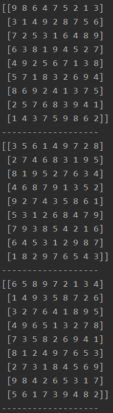

# Sudoku random generator
Sudoku random generator

This program generates a random completed valid sudoku which the user can then use to remove numbers and create a sudoku to be solved. The sudoku_sovler.py can then be used to find all the solutions to the sudoku and if there is more than one solution one can add a few removed numbers back into the sudoku.

